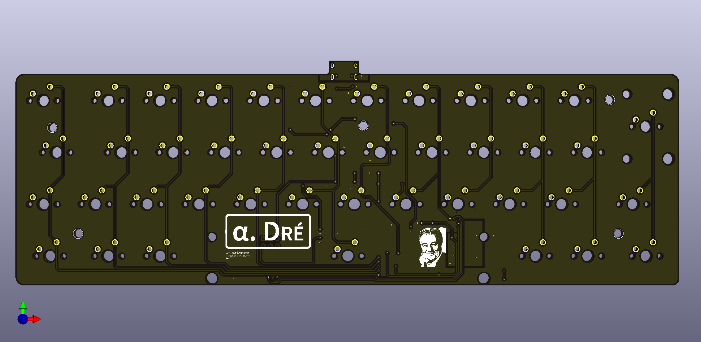
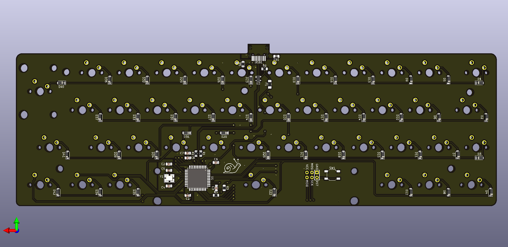

# Alpha Dré

__Or "How to fit a french ISO layout in a 40% keyboard ?__

## Presentation

This project aims to create a minimalist mechanical keyboard from scratch. It will therefore include all the 3D files and various pcb related files to conduct the project along with a documentation to build the keyboard.

The keyboard presents 42 keys that are placed in an ISO layout, and even if the layout seems odd, most of keycaps set will fit this design. On the software side, the different layers of the keyboard remain to be done.

The pcb has been designed with Kicad software and gerbers files are available in the dedicated folder. This pcb hosts an Atmega32U4-AU for the keyboard control and is (as for other electronic components) soldered in surface. 

The case is an *high profile* one (meaning the eletronic parts and switches are hidden by the case) and has been designed to be manufactured with only laser cut acrylic plates of various sizes. These plates are fixed with M2 screws (M2x16) and are hidden with rubber bumps on the bottom of the case. This conception leads to a *sandwich mount* keyboard.

In order to give the keyboard a little angle for typing, two different feet have been design to be screwed at the back of the case.

A last option of low profile (barely no case) is available and needs practicaly no manufacturing. This option leads to a *tray mount* keyboard with no plate... 

Here is a global list of all parts needed to perform this keyboard build:

- [ ] Laser cut acrylic plates
- [ ] Screws
- [ ] SMD components fot the pcb
- [ ] pcb plate
- [ ] 42 switches
- [ ] 6.25u and 2u stabilizers
- [ ] ISO keycap set
- [ ] Soldering tools
- [ ] Drill and threading tools

## Documents

- [case documentation](case/case_doc.md)
- [pcb documentation](pcb/pcb_doc.md)

## Aknowledgment

- [Masterzen "Designing a keyboard from scratch" guide](https://www.masterzen.fr/2020/05/03/designing-a-keyboard-part-1/)
- [French mechanical keyboard community](https://github.com/mkbdfr) (without their feedback and help none of this would have been possible)