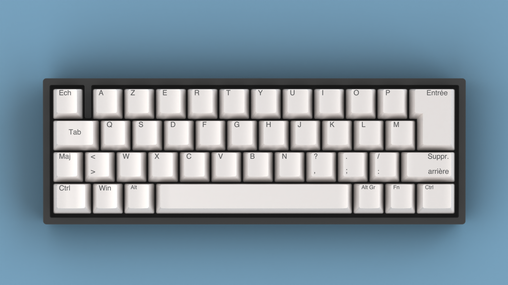
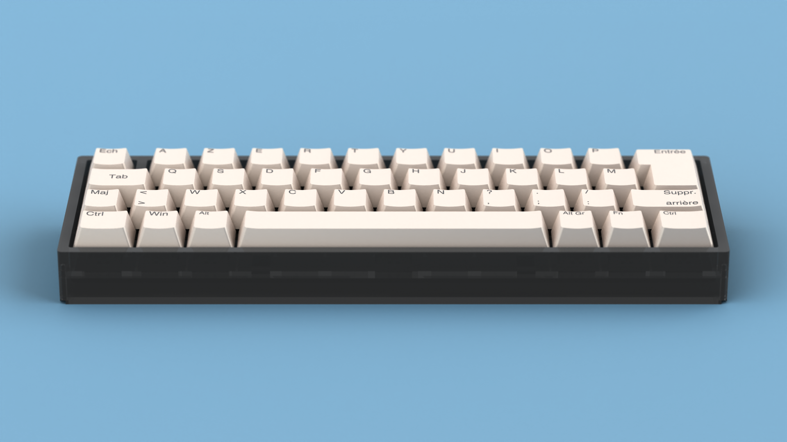
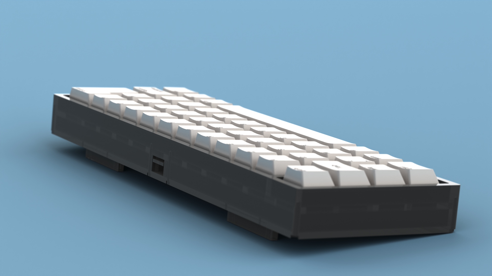
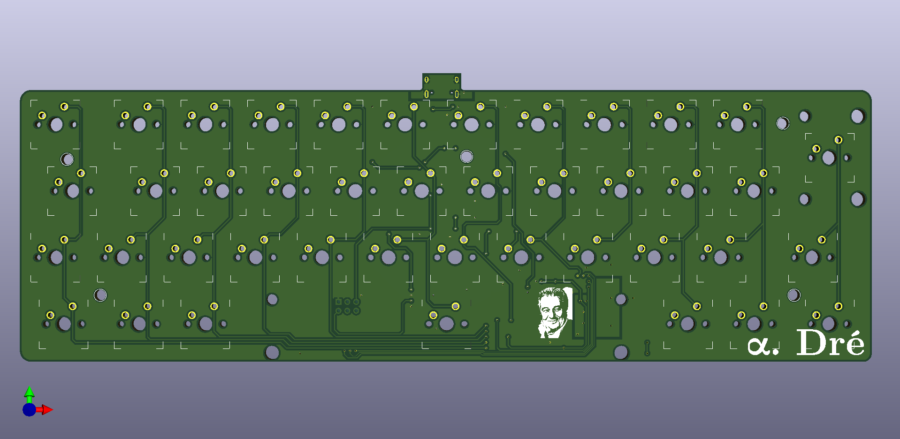
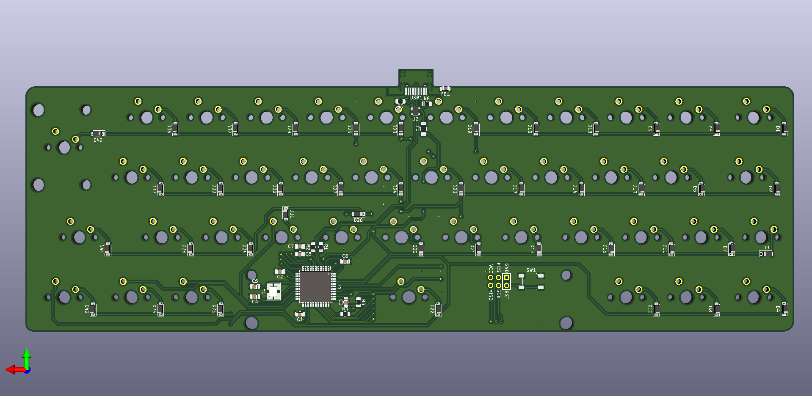

# Alpha Dré

__Or "How to fit a french ISO layout in a 40% keyboard ?__

This project aims to create a minimalist mechanical keyboard from scratch. It will therefore include all the 3D files and various pcb related files to conduct the project.

## Renders

To get a better glimpse of the project, some renders have been done. They can give a good approximation of the end result product and are therefore a precious help for tweaking parameters.

## Layout

The physical layout of the keyboard presents 42 keys that are compatible with most of keycaps sets.

The different layers of the keyboard still remain unknown at the moment...

## PCB

The 3D view of the PCB looks like this:

## BUILD

Rought list of all the needed parts:

| Category | Designation | Number | Status |
|----------|-------------|--------|--------|
| Case     | Acrylic plates (3mm and 8 mm) | 4 | :heavy_check_mark:
|          | M2 screws   | 10 | :heavy_check_mark: |
| PCB      | SMD components | too much | :heavy_check_mark: |
|          | PCB plate   | 5 | :heavy_check_mark: |
| Other    | Switches    | 42 | :heavy_check_mark: |
|          | Stabilisators | 2 (6.25u & 2u) | :heavy_check_mark: |
|          | Keycaps set (ISO) | 1 | :heavy_check_mark: |

### PCB

|Designation|Type             |Footprint         |Quantity|
|-----------|-----------------|------------------|--------|
|FB1        |Ferrite bead     |805               |1       |
|USB1       |USB connector    |HRO-TYPE-C-31-M-12|1       |
|U2         |PRTR5V0U2X       |SOT143B           |1       |
|SW1        |Reset switch     |SKQG              |1       |
|R6,R5      |5.1 kOhm resistor|805               |2       |
|R4,R3      |10 kOhm resistor |805               |2       |
|R2,R1      |22 Ohm resistor  |805               |2       |
|C8,C3,C2,C1|100 nF capacitor |805               |4       |
|Y1         |16 MHz crystal   |3225              |1       |
|U1         |Atmega 32U4-AU   |TQFP-44           |1       |
|F1         |PTC Fuse         |1206              |1       |
|C7         |1 uF capacitor   |805               |1       |
|C6         |10 uF capacitor  |805               |1       |
|C5,C4      |22 pF capacitor  |805               |2       |
|D1-42      |Diode            |SOD-123           |42      |

### Case

## Aknowledgment

- [Masterzen "Designing a keyboard from scratch" guide](https://www.masterzen.fr/2020/05/03/designing-a-keyboard-part-1/)
- French mechanical keyboard community (without their feedback and help non of this would be possible)