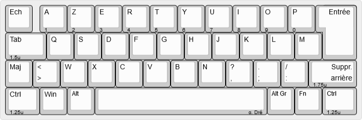
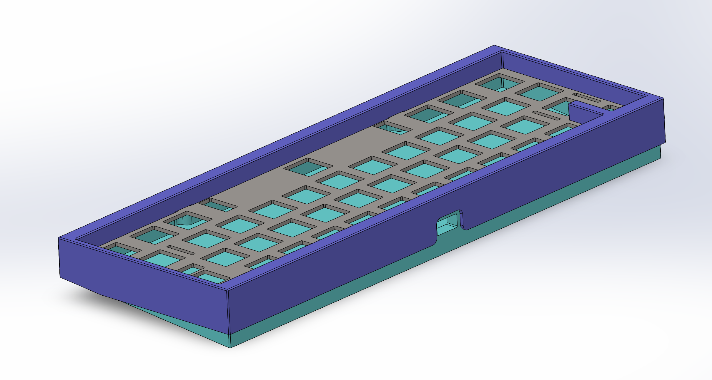
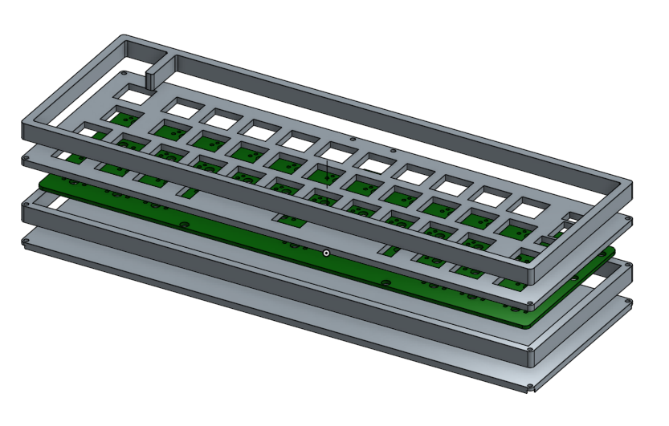
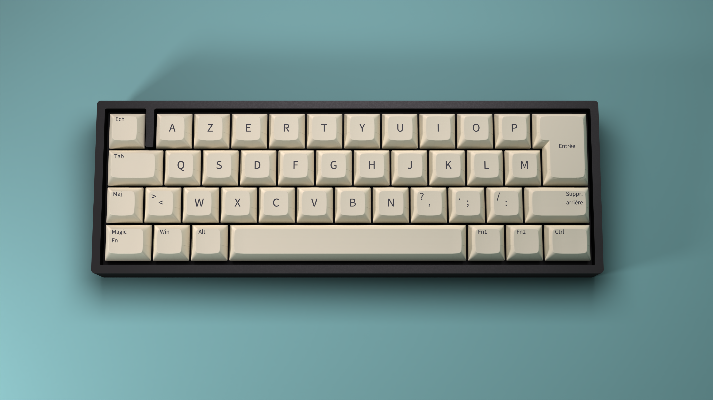
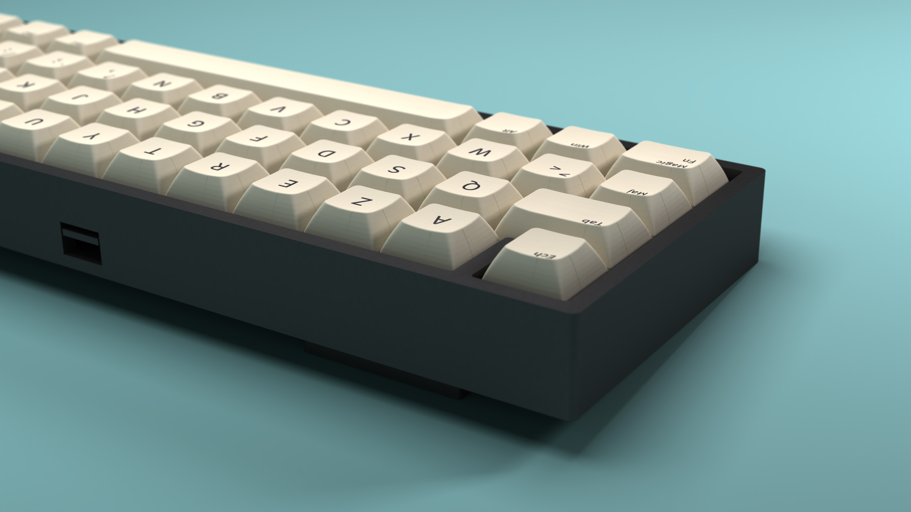

# &#945;. Dré

__Or "How to fit an ISO layout in a 40% keyboard ?"__

## Presentation

This project started as a need to find a **new mechanical keyboard with a french ISO layout support**. It also aims to keep a minimalist design that we can find on most 40% keyboards. It will therefore include all the 3D CAD files and various pcb related files to conduct the project along with a documentation to build the keyboard.

This keyboard is __Via and Vial compatible__ to give a better user experience (especially when it comes to remapping keys).

__All pictures of this project can be found [here](https://flic.kr/s/aHsmVLZSPn)__ (acrylic case) __and [here](https://flic.kr/s/aHsmVCqc8F)__ (no plate tray mount)

### Layout

The keyboard presents 42 keys that are placed in an ISO layout, and even if the layout seems odd, most of keycaps set will fit this design. With juste 3 layers the keyboard becomes fully usable as shown in the firmware part.

### PCB

The pcb has been designed with Kicad software and gerbers files are available in the dedicated folder. This pcb hosts an Atmega32U4-AU for the keyboard control and is (as for other electronic components) soldered in surface. 

More on the pcb design available in the documentation file.

### Case

#### 3D printed version

A top mounted case aimed to be 3D printed has been done to complete the build.

Blueprints are available in dedicated folder, short link to pdf blueprints :
- [global assembly](https://raw.githubusercontent.com/antoineandre/alpha_dre/main/case/3D_print/assembly_blueprint.pdf)
- [top part](https://raw.githubusercontent.com/antoineandre/alpha_dre/main/case/3D_print/bottom_part_blueprint.pdf)
- [bottom part](https://raw.githubusercontent.com/antoineandre/alpha_dre/main/case/3D_print/top_part_blueprint.pdf)

#### Acrylic stack
The case is a *high profile* one (meaning the electronic parts and switches are hidden by the case) and has been designed to be manufactured with only laser cut acrylic plates of various sizes. These plates are fixed with M2 screws (M2x16) and are hidden with rubber bumps on the bottom of the case. This conception leads to a *sandwich mount* keyboard.

In order to give the keyboard a little angle for typing, two different feet have been design to be screwed at the back of the case.

A last option of low profile (barely no case) is available and needs practically no manufacturing. This option leads to a *tray mount* keyboard with no plate (this is the chosen option shown in the beginning of this presentation).

*Side note on the acrylic case : the design was a bit too lose and the gap between keycaps and top layer of the case can be reduced. Furthermore the plate was designed to host plate mounted stabilizers, but the pcb was designed for pcb mounted stabs...*

### Parts

Here is a global list of all parts needed to perform this keyboard build:

- [ ] Laser cut acrylic plates
- [ ] Screws (M2 for sandwich mount and M3 for skeleton mount)
- [ ] SMD components fot the pcb (see the pcb documentation for more details)
- [ ] pcb plate
- [ ] 42 switches
- [ ] 6.25u and 2u stabilizers
- [ ] ISO keycap set
- [ ] Soldering tools
- [ ] Drill and threading tools

## Documents

- [case documentation](case/case_doc.md)
- [pcb documentation](pcb/pcb_doc.md)
- [firmware documentation](firmware/alpha_dre/readme.md)

### Results

A first prototype with a simple skeleton case made out of plexiglass have been made to validate that the keyboard was responding correctly to the firmware and was usable. More on the cases will be done in the future (notably with the cut acrylic plates for the sandwich mount and with a 3d printed case).

Second prototype was made with acrylic sandwich plates (as intended in the original project). Two pictures showing the results of this case can be seen below.

### Renders

A bunch of renders have been made to validate the overall looking of the keyboard.

__Complete set of renders__ can be found __[here](docs/renders/renders_doc.md)__

## Aknowledgment

- [Masterzen "Designing a keyboard from scratch" guide](https://www.masterzen.fr/2020/05/03/designing-a-keyboard-part-1/)
- [French mechanical keyboard community](https://github.com/mkbdfr) for their help, feedback and amelioration propositions to make this design as "usable" as possible.
