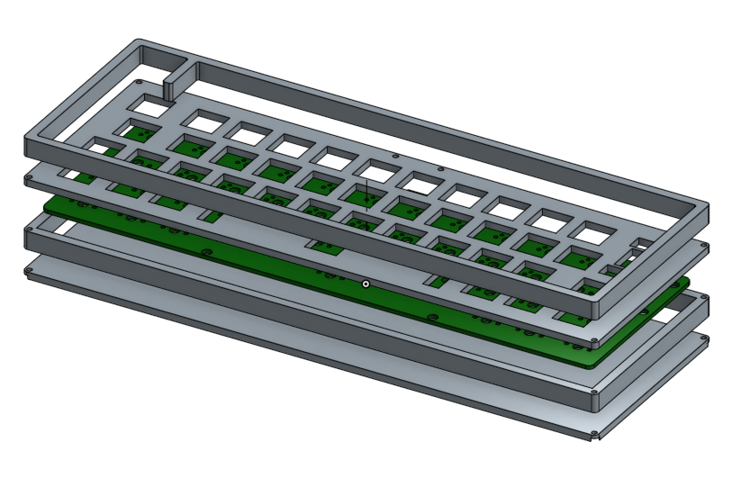
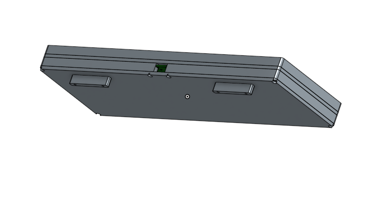

# Case conception and build

## 3D printed case Rev2

Blueprints are available here as pdf:
- [assembly scheme](https://github.com/AntoineAndre/alpha_dre/raw/main/case/3D_print/assembly_blueprint.pdf)
- [top part scheme](https://github.com/AntoineAndre/alpha_dre/raw/main/case/3D_print/top_part_blueprint.pdf)
- [top part scheme](https://github.com/AntoineAndre/alpha_dre/raw/main/case/3D_print/bottom_part_blueprint.pdf)

## Acrylic case Rev1

