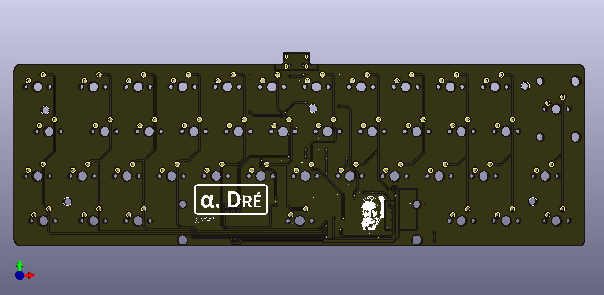

# Alpha. Dré PCB documentation

## Main design

Even if the design is planed to be sandwich mounted with a stack of acrylic plate, the PCB design offers the possibily to go for a trail mount with dedicated M3 holes (5 evenly spaced on the PCB).

## Part list

The PCB has been designed to be soldered with SMD components and therefore needs a lot of different electronic parts that are listed below:

|Designation|Type             |Footprint         |Quantity|
|-----------|-----------------|------------------|--------|
|FB1        |Ferrite bead     |805               |1       |
|USB1       |USB connector    |HRO-TYPE-C-31-M-12|1       |
|U2         |PRTR5V0U2X       |SOT143B           |1       |
|SW1        |Reset switch     |SKQG              |1       |
|R6,R5      |5.1 kOhm resistor|805               |2       |
|R4,R3      |10 kOhm resistor |805               |2       |
|R2,R1      |22 Ohm resistor  |805               |2       |
|C8,C3,C2,C1|100 nF capacitor |805               |4       |
|Y1         |16 MHz crystal   |3225              |1       |
|U1         |Atmega 32U4-AU   |TQFP-44           |1       |
|F1         |PTC Fuse         |1206              |1       |
|C7         |1 uF capacitor   |805               |1       |
|C6         |10 uF capacitor  |805               |1       |
|C5,C4      |22 pF capacitor  |805               |2       |
|D1-42      |Diode            |SOD-123           |42      |

## Results

After soldering the PCB with all above listed parts the results shooted with a macro lense looks as follow :

